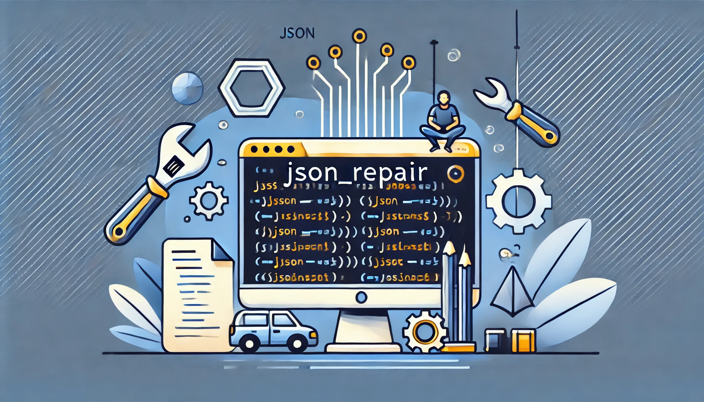

# json_repair — 修复损坏的 JSON（Python 工具包）

[](https://pypi.org/project/json-repair/)  [](https://pypi.org/project/json-repair/) [](https://pepy.tech/projects/json-repair) [](https://github.com/sponsors/mangiucugna) [](https://github.com/mangiucugna/json_repair/stargazers)

> 本文档由 AI 翻译，如有疏漏欢迎指正。  
English | **中文**

这个轻量工具包可以修复无效的 JSON 字符串。想了解支持的全部场景，请查看单元测试。



---

# 想支持这个项目？
这个库免费且由作者业余维护。如果它帮到了你的工作，欢迎在 GitHub Sponsors 支持：https://github.com/sponsors/mangiucugna

## 高级赞助商
- [Icana-AI](https://github.com/Icana-AI) —— CallCoach（全球领先的呼叫中心 AI 教练）的开发者。访问 [https://www.icana.ai/](https://www.icana.ai/)。

---

# 演示
- 中文提示的在线演示（GitHub Pages）：https://mangiucugna.github.io/json_repair/index.zh.html  
- 英文演示：https://mangiucugna.github.io/json_repair/
- Google NotebookLM 英文音频介绍：https://notebooklm.google.com/notebook/05312bb3-f6f3-4e49-a99b-bd51db64520b/audio

---

# 动机
许多大模型输出的 JSON 并不规范：有时缺一个括号，有时多出文本。幸运的是，大部分错误足够简单，可以在不破坏内容的情况下修复。找不到一个轻量、可靠的 Python 包能处理这些问题，于是就写了 json_repair。

# 支持的用例

### 修复 JSON 语法错误
- 缺失引号、逗号错误、未转义字符、不完整的键值对。
- 布尔/空值写错（true/false/null），修复损坏的键值结构。

### 修复损坏的数组和对象
- 补全/修复未完成的数组或对象，添加必要的元素（逗号、括号）或默认值（null、""）。
- 清理包含额外非 JSON 字符（如注释、杂项文本）的字符串，尽量保持结构。

### 自动补全缺失值
- 自动为缺失的字段补充合理默认值（如空字符串或 null），保证可解析。

# 如何使用

安装：
```
pip install json-repair
```

基础用法：
```python
from json_repair import repair_json

good_json_string = repair_json(bad_json_string)
# 如果输入极度损坏，可能返回空字符串
```

替代 `json.loads()`：
```python
import json_repair

decoded_object = json_repair.loads(json_string)
# 或者
decoded_object = json_repair.repair_json(json_string, return_objects=True)
```

### 避免反模式
不需要先 `json.loads()` 失败再调用 json_repair；如果确定输入损坏，直接传 `skip_json_loads=True`：
```python
obj = repair_json(bad_json_string, skip_json_loads=True)
```

### 从文件读取
json_repair 也提供 `json.load()` 的替代：
```python
from json_repair import load, from_file

decoded_object = load(open(fname, "rb"))
decoded_object = from_file(fname)
```
I/O 异常不会被库捕获，需要由调用方处理。

### 非拉丁字符
处理中文/日文/韩文等时，传入 `ensure_ascii=False` 保留原文：
```python
repair_json("{'test_chinese_ascii':'统一码'}", ensure_ascii=False)
```

### 透传 json.dumps 参数
`repair_json` 支持并透传 `json.dumps` 的参数（如 `indent`）。

### 性能提示
- `return_objects=True` 更快，因为直接返回对象。
- 只有在确定输入不是有效 JSON 时才用 `skip_json_loads=True`。
- 如有转义问题，传入原始字符串（如 `r"string with escaping\""`）。
- 不依赖第三方加速库，便于在任意环境使用。

### 严格模式
默认尽量修复；若需要严格校验而非修复，可传 `strict=True`：
```python
from json_repair import repair_json
repair_json(bad_json_string, strict=True)
```
严格模式会在发现结构问题（重复键、缺少冒号、空键/值、多个顶层元素等）时立刻抛出 `ValueError`。CLI 也支持 `json_repair --strict input.json`。

严格模式可与 `skip_json_loads=True` 组合：跳过初始 `json.loads` 检查，但仍执行严格解析规则。

### 流式处理
需要在流式数据上修复 JSON 时，可传 `stream_stable=True`：
```python
stream_output = repair_json(stream_input, stream_stable=True)
```

### CLI 使用
安装命令行工具：
```bash
pipx install json-repair
```
查看选项：
```
$ json_repair -h
usage: json_repair [-h] [-i] [-o TARGET] [--ensure_ascii] [--indent INDENT] [filename]

Repair and parse JSON files.

positional arguments:
  filename              The JSON file to repair (if omitted, reads from stdin)

options:
  -h, --help            show this help message and exit
  -i, --inline          Replace the file inline instead of returning the output to stdout
  -o TARGET, --output TARGET
                        If specified, the output will be written to TARGET filename instead of stdout
  --ensure_ascii        Pass ensure_ascii=True to json.dumps()
  --indent INDENT       Number of spaces for indentation (Default 2)
  --strict              Raise on duplicate keys, missing separators, empty keys/values, and similar structural issues instead of repairing them
```

---

## 在 requirements 中依赖
**请只固定大版本号！**  
采用严格语义化版本与 TDD，次版本/补丁版本不会引入破坏性更新，更新频繁。建议在 `requirements.txt` 里使用：
```
json_repair==0.*
```

---
# 如何引用
如果你在学术工作中使用了本库，BibTex 如下：
```
@software{Baccianella_JSON_Repair_-_2025,
    author  = "Stefano {Baccianella}",
    month   = "feb",
    title   = "JSON Repair - A python module to repair invalid JSON, commonly used to parse the output of LLMs",
    url     = "https://github.com/mangiucugna/json_repair",
    version = "0.39.1",
    year    = 2025
}
```
欢迎引用并分享论文链接！

---

# 工作原理
模块按照 BNF 解析 JSON，并在发现问题时使用启发式修复：
```
<json> ::= <primitive> | <container>

<primitive> ::= <number> | <string> | <boolean>
; 其中:
; <number> 是合法的实数
; <string> 是用引号包裹的字符串
; <boolean> 为 'true' / 'false' / 'null'

<container> ::= <object> | <array>
<array> ::= '[' [ <json> *(', ' <json>) ] ']'
<object> ::= '{' [ <member> *(', ' <member>) ] '}'
<member> ::= <string> ': ' <json>
```
若解析出错（如缺少括号或引号），将尝试：
- 补充缺失的括号/大括号。
- 为字符串补引号或补单引号。
- 调整空白并移除多余换行。

如有遗漏的边界情况，欢迎提交 Issue 或 PR。

# 开发指南
创建虚拟环境并安装 `requirements.txt`。项目使用 [pre-commit](https://pre-commit.com/) 在提交前运行检查。提交后请确认 GitHub Actions 通过。

# 发布指南
需要仓库 owner 权限：
- 修改 `pyproject.toml`，按照 semver 更新版本。
- **先提交并推送所有改动，否则后续步骤会失败。**
- 运行 `python -m build`。
- 在 GitHub 创建 Release，标记已解决的 Issue 与贡献者，Tag 与版本一致。
- Release 创建后会触发 GitHub Actions 发布到 PyPI，确认任务通过。

---
# 其他语言的 JSON 修复
- Typescript: https://github.com/josdejong/jsonrepair
- Go: https://github.com/RealAlexandreAI/json-repair
- Ruby: https://github.com/sashazykov/json-repair-rb
- Rust: https://github.com/oramasearch/llm_json
- R: https://github.com/cgxjdzz/jsonRepair
- Java: https://github.com/du00cs/json-repairj

---
## Star History

[](https://star-history.com/#mangiucugna/json_repair&Date)
